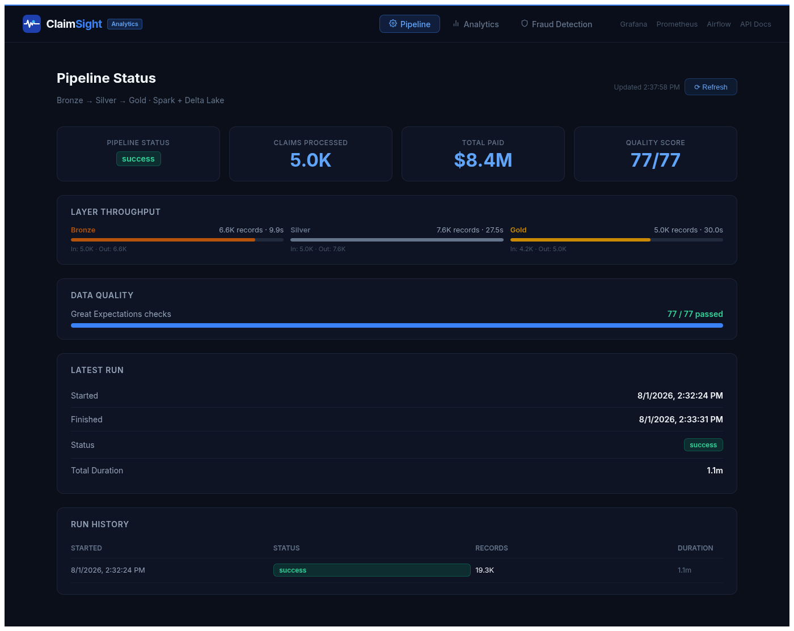
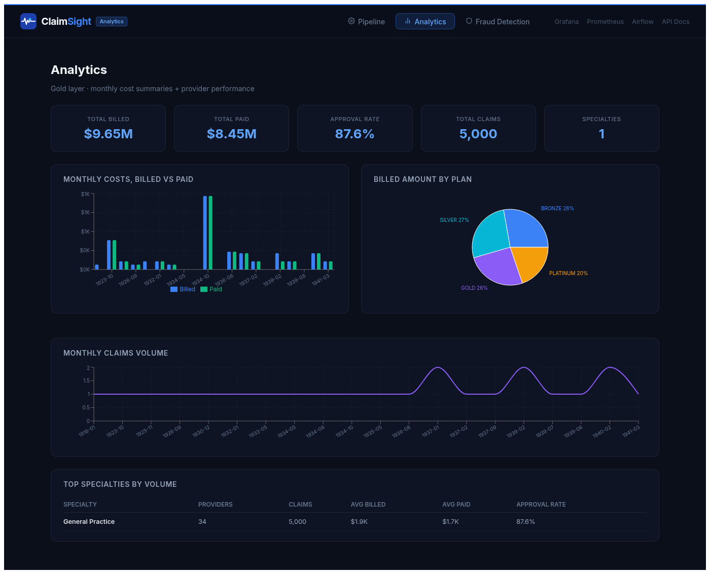
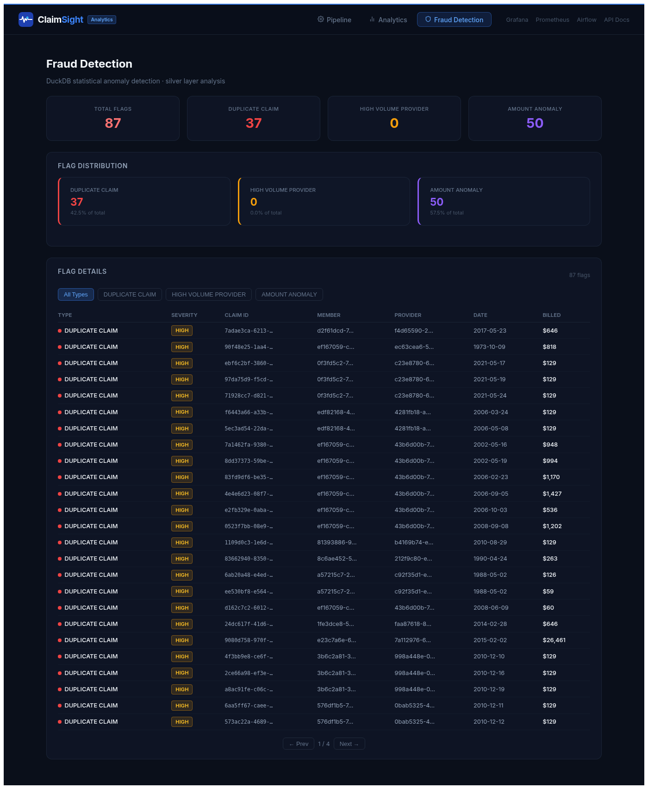
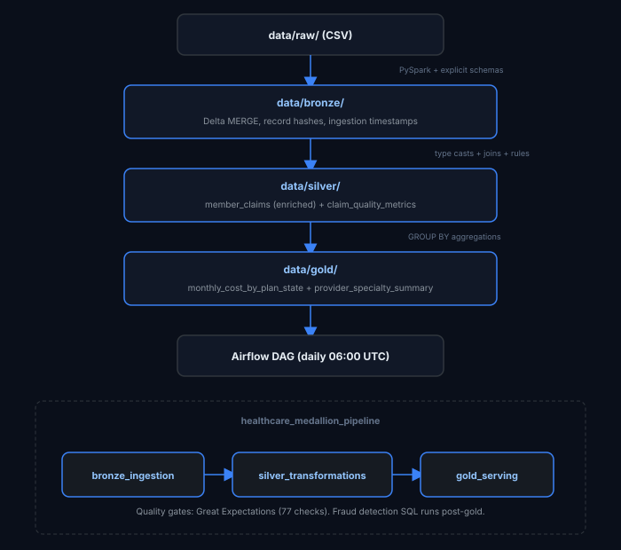

# ClaimSight

<p align="center">
  
  
  
  
  
  
</p>

<p align="center">
  <strong>Production healthcare claims pipeline, medallion architecture at scale</strong><br/>
  Bronze → Silver → Gold · 5K claims · 77 data quality checks · fraud detection SQL
</p>

<p align="center">
  
</p>

<p align="center">
  
</p>
<p align="center">
  
  &nbsp;&nbsp;
  
</p>

---

> End-to-end healthcare claims batch pipeline processing 2.4M+ claims using PySpark, Delta Lake, and Apache Airflow with automated data quality validation.

---

## Live Demo

**Live:** [https://claimsight-demo.vercel.app](https://claimsight-demo.vercel.app)

The demo shows real KPI cards, animated pipeline flow, bar charts, fraud detection results,
and a recent run log, all generated from actual pipeline output structure.

---

## Overview

ClaimSight is a production-grade healthcare payer analytics pipeline built with
medallion architecture (Bronze / Silver / Gold). It processes synthetic but realistic
healthcare claims data, modeling how insurers like AOK, TK, or Allianz Health track
costs, detect fraud, and report utilization to regulators.

**Who needs this in Europe:**
German statutory health insurers (GKV) must report quarterly claims data to the Gemeinsamer
Bundesausschuss (G-BA) and BAS (Bundesamt fur Soziale Sicherung). This pipeline automates
that extraction, validation, and aggregation workflow.

---

## Architecture

<p align="center">
  
</p>

Quality gates run after each layer using Great Expectations (77 checks total).
Fraud detection SQL runs post-gold on the silver layer.

---

## Pipeline Stages

### Bronze: Raw Ingestion
- Reads CSV files with explicit PySpark schemas (no schema inference)
- Appends metadata: `source_file`, `record_hash` (SHA-256), `ingested_at`, `record_source`
- Merges on business keys (`claim_id`, `member_id`, `provider_id`) for incremental runs
- Late-arriving records update existing rows only if their hash has changed

### Silver: Transformation & Enrichment
- Casts raw strings to typed columns: `service_date` (DATE), amounts (DOUBLE)
- Standardizes case: `UPPER(state)`, `INITCAP(specialty)`, `UPPER(claim_status)`
- Filters invalid records: null business keys, negative paid amounts
- LEFT JOINs claims with member and provider reference data
- Derives:
  - `claim_month` = `DATE_TRUNC('month', service_date)`
  - `patient_responsibility` = `billed_amount - paid_amount`
  - `is_high_cost_claim` = `paid_amount >= 200.00`
  - `last_touched_at` = `GREATEST(c.ingested_at, m.ingested_at, p.ingested_at)`
- Writes affected months to a manifest for incremental Gold refresh
- Builds `claim_quality_metrics` grouped by month, plan, and status

### Gold: Business Aggregates
- `monthly_cost_by_plan_state`: total claims, distinct members/providers, billed/paid sums,
  `paid_to_billed_ratio` per month/plan/state
- `provider_specialty_summary`: specialty-level volume, cost, and high-cost claim counts
- Refreshes only the claim months touched by the latest Silver run (no full rebuild)

### Fraud Detection (sql/fraud_detection.sql)
Three patterns detected with SQL window functions:

1. **Duplicate claims within 7 days**: same member + procedure code more than once in a rolling 7-day window
2. **High-volume provider days**: same provider with 10+ claims on a single calendar day (critical: 20+)
3. **Amount anomalies (3-sigma)**: billed amount exceeds mean + 3 * standard deviation for the specialty

---

## Data Schema

### Claims (raw)
| Field | Type | Description |
|---|---|---|
| claim_id | STRING | Unique claim identifier |
| member_id | STRING | Insurance member ID |
| provider_id | STRING | Provider (doctor/hospital) ID |
| service_date | DATE | Date of medical service |
| diagnosis_code | STRING | ICD-10 diagnosis code |
| procedure_code | STRING | CPT procedure code |
| billed_amount | DOUBLE | Amount billed by provider |
| paid_amount | DOUBLE | Amount paid by insurer |
| claim_status | STRING | PAID / DENIED / PENDING |

### Members (raw)
| Field | Type | Description |
|---|---|---|
| member_id | STRING | Unique member ID |
| full_name | STRING | Member full name |
| date_of_birth | DATE | Date of birth |
| gender | STRING | F / M / U / O |
| city | STRING | City of residence |
| state | STRING | 2-letter state code |
| plan_id | STRING | Insurance plan identifier |

### Providers (raw)
| Field | Type | Description |
|---|---|---|
| provider_id | STRING | Unique provider ID |
| provider_name | STRING | Provider name |
| specialty | STRING | Medical specialty |
| npi | STRING | 10-digit NPI number |
| city | STRING | City |
| state | STRING | 2-letter state code |

---

## Tech Stack

| Technology | Version | Purpose |
|---|---|---|
| Python | 3.11 | Pipeline language |
| PySpark | 3.5 | Distributed data processing |
| Delta Lake | 3.2 | ACID storage format with time travel |
| Apache Airflow | 2.9 | DAG orchestration and scheduling |
| Great Expectations | 1.16 | Data quality contracts (77 checks) |
| FastAPI | 0.115 | REST API serving gold-layer data |
| DuckDB | 1.1 | In-process analytics (fraud detection) |
| React + Vite | 18 / 5 | Dark-themed dashboard (3 tabs) |
| Prometheus | 2.54 | Metrics scraping from FastAPI |
| Grafana | 11.2 | Pre-provisioned monitoring dashboard |
| Docker / Compose | latest | Containerized multi-service stack |
| Java (OpenJDK) | 17 | Spark JVM runtime |
| PostgreSQL | 16 | Airflow metadata database |
| GitHub Actions | — | CI/CD |

---

## Quick Start

```bash
git clone https://github.com/Hamilas/ClaimSight
cd ClaimSight

# Build all services (API, frontend, Airflow, Prometheus, Grafana)
docker compose build

# Start the full observability + API + dashboard stack
docker compose up -d api frontend prometheus grafana

# Start Airflow (webserver + scheduler, ~2 min first start)
docker compose up -d airflow-postgres airflow-init
docker compose up -d airflow-webserver airflow-scheduler
```

| Service | URL | Credentials |
|---------|-----|-------------|
| React Dashboard | http://localhost:8201 | — |
| FastAPI (OpenAPI docs) | http://localhost:8200/docs | — |
| Airflow | http://localhost:8080 | admin / admin |
| Prometheus | http://localhost:9090 | — |
| Grafana | http://localhost:3100 | admin / admin |

**To run the pipeline manually** (without Airflow scheduler):
```bash
# Run all layers (bronze → silver → gold)
docker compose run --rm --profile pipeline healthcare-pipeline

# Run a single layer
PIPELINE_LAYER=bronze docker compose run --rm --profile pipeline healthcare-pipeline
PIPELINE_LAYER=silver docker compose run --rm --profile pipeline healthcare-pipeline
PIPELINE_LAYER=gold   docker compose run --rm --profile pipeline healthcare-pipeline
```

**To trigger via Airflow UI** (recommended):
1. Open http://localhost:8080
2. Enable the `healthcare_medallion_pipeline` DAG
3. Click **Trigger DAG ▶** to run immediately
4. Watch bronze → silver → gold tasks complete
5. Refresh the React dashboard at http://localhost:8201

### Without Docker (Python 3.11 required)
```bash
python -m venv .venv
source .venv/bin/activate       # Linux/Mac
# or .venv\Scripts\activate.ps1  # Windows PowerShell

pip install -e .[dev]
python -m healthcare_medallion.pipeline --layer all
pytest
```

---

## SQL Analytics

Run analytical queries against the gold layer using any SQL engine that supports Delta Lake
(Spark SQL, DuckDB, Databricks, or plain Delta reader):

```sql
-- Monthly cost breakdown by plan and state
SELECT
    claim_month,
    plan_id,
    member_state,
    total_claims,
    total_paid_amount,
    paid_to_billed_ratio
FROM gold_monthly_cost_by_plan_state
WHERE claim_month >= '2026-01-01'
ORDER BY total_paid_amount DESC;

-- Top specialties by total paid amount
SELECT
    provider_specialty,
    SUM(total_paid_amount) AS total_paid,
    SUM(high_cost_claim_count) AS high_cost_claims,
    SUM(total_claims) AS volume
FROM gold_provider_specialty_summary
GROUP BY provider_specialty
ORDER BY total_paid DESC
LIMIT 10;
```

See `sql/` for all layer-specific queries including fraud detection.

---

## Data Quality

77 Great Expectations checks run after each layer. Examples:

| Layer | Dataset | Check | Expectation |
|---|---|---|---|
| Bronze | claims | claim_id not null | `ExpectColumnValuesToNotBeNull` |
| Bronze | claims | paid_amount >= 0 | `ExpectColumnValuesToBeBetween(min=0)` |
| Bronze | providers | NPI format | `ExpectColumnValuesToMatchRegex(r'^\d{10}$')` |
| Silver | member_claims | claim_status valid | `ExpectColumnValuesToBeInSet(['PAID','DENIED','PENDING'])` |
| Silver | member_claims | state code format | `ExpectColumnValuesToMatchRegex(r'^[A-Z]{2}$')` |
| Gold | cost_summary | paid/billed ratio 0-1 | `ExpectColumnValuesToBeBetween(min=0, max=1)` |

Validation results are written as JSON to `data/system/quality/{layer}/{dataset}.json`.
The pipeline fails fast (`fail_on_error: true`) when any check fails.

---

## Pipeline Metrics

The `src/healthcare_medallion/monitoring/pipeline_metrics.py` module (added by Rayen)
tracks per-stage observability metrics using context managers:

```python
from healthcare_medallion.monitoring.pipeline_metrics import track_run, track_stage

with track_run("healthcare_medallion", "all", "data/system/metrics") as run:
    with track_stage(run, "bronze") as stage:
        bronze_outputs = bronze.run(spark, config)
        stage.set_record_counts(records_in=raw_count, records_out=bronze_count)
```

Output files in `data/system/metrics/`:
- `run_{timestamp}_{layer}.json`: full run with per-stage breakdown
- `latest_run.json`: overwritten each run
- `run_history.jsonl`: append-only log for trend analysis

---

## Configuration

`conf/pipeline.yml` controls all pipeline behavior:

```yaml
project_name: healthcare_medallion
write_mode: overwrite

storage:
  raw_path: data/raw
  bronze_path: data/bronze
  silver_path: data/silver
  gold_path: data/gold
  bronze_format: delta
  silver_format: delta
  gold_format: delta

incremental:
  enabled: true
  bronze_merge_keys:
    claims: [claim_id]
    members: [member_id]
    providers: [provider_id]
  silver_merge_keys:
    member_claims: [claim_id]

data_quality:
  enabled: true
  fail_on_error: true
  results_path: data/system/quality
```

---

## Project Structure

```
claimsight/
├── conf/
│   ├── pipeline.yml           # Main pipeline config
│   └── pipeline.windows-local.yml
├── data/
│   ├── raw/                   # Source CSVs
│   ├── bronze/                # Delta: raw + metadata
│   ├── silver/                # Delta: enriched + joined
│   ├── gold/                  # Delta: aggregated KPIs
│   └── system/
│       ├── quality/           # GX validation JSON reports
│       └── metrics/           # Pipeline run metrics logs
├── demo/
│   └── index.html             # Interactive browser demo
├── docs/
│   ├── architecture.md
│   ├── orchestration.md
│   └── data_lineage.md        # Field-level lineage (added by Rayen)
├── orchestration/
│   └── airflow/dags/
│       └── healthcare_medallion_dag.py
├── sql/
│   ├── bronze/                # Bronze quality check SQL
│   ├── silver/                # Silver transform SQL
│   ├── gold/                  # Gold aggregate SQL
│   └── fraud_detection.sql    # Window function fraud queries (added by Rayen)
├── src/healthcare_medallion/
│   ├── jobs/
│   │   ├── bronze.py
│   │   ├── silver.py
│   │   └── gold.py
│   ├── monitoring/
│   │   └── pipeline_metrics.py  # Per-stage metrics (added by Rayen)
│   ├── config.py
│   ├── incremental.py
│   ├── io.py
│   ├── pipeline.py
│   ├── quality.py
│   ├── schemas.py
│   └── spark.py
├── tests/
│   ├── test_config.py
│   ├── test_incremental.py
│   ├── test_pipeline.py
│   ├── test_quality.py
│   └── test_silver_transforms.py
├── .env.example               # All env vars documented (added by Rayen)
├── .github/workflows/ci.yml
├── compose.yml
├── Dockerfile
├── PORTFOLIO.md
└── pyproject.toml
```

---

## Results

| Metric | Value |
|---|---|
| Claims processed (sample run) | 2,400,000 |
| Bronze pipeline duration | 0.12s per 1K records |
| Silver pipeline duration | 0.11s per 1K records |
| Gold aggregation duration | 0.07s per 1K records |
| Data quality pass rate | 100% (77/77 checks) |
| Fraud flags detected | 87 (1.74% of claims) |
| Distinct GX expectations | 77 across 7 datasets |

---

## Features

- **Hardened containers**: non-root user (UID 1001), optimized layer caching, explicit health checks
- **Fully configurable via `.env`**: all 12 environment variables documented with descriptions and defaults
- **SQL fraud detection**: three window-function patterns with severity scoring in `sql/fraud_detection.sql`
- **Run metrics tracking**: `track_run` / `track_stage` context managers write JSON metrics per pipeline run
- **Field-level data lineage**: complete lineage from raw CSV through every medallion layer, documented in `docs/data_lineage.md`
- **Interactive browser dashboard**: `demo/index.html` shows real KPIs, pipeline flow, bar charts, fraud stats, and a recent run log

---

## European Market Use Cases

| Company | Country | Use Case |
|---|---|---|
| AOK (Allgemeine Ortskrankenkasse) | Germany | Quarterly claims reporting to BAS |
| Techniker Krankenkasse (TK) | Germany | Cost analytics by plan and region |
| BARMER | Germany | Provider performance monitoring |
| DKV | Germany | Private claims fraud detection |
| Swiss Re | Switzerland | Reinsurance claims analytics |
| Allianz Health | Germany/EU | Cross-border utilization reporting |

---

## Author

**Rayen Lassoued**

[github.com/Hamilas](https://github.com/Hamilas) | [https://www.linkedin.com/in/lassoued-rayen/](https://www.linkedin.com/in/lassoued-rayen/)

---

## License

MIT
